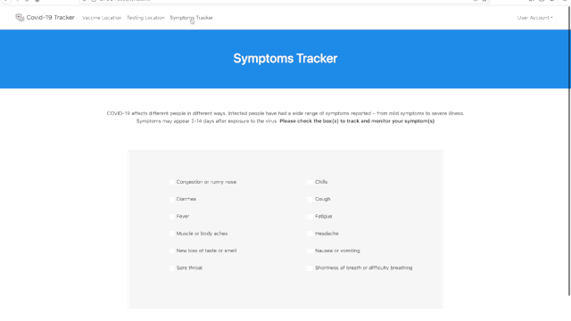

# California Covid-19 Tracker | [Demo Video](https://youtu.be/P3Qpdf1KZoI)

<!-- TABLE OF CONTENTS -->

  
Table of Contents

  <ol>
    <li><a href="#about-the-project">About The Project</a></li> 
    <li><a href="#built-with">Built With</a></li>
    <li><a href="#installation">Installation</a></li>
    <li><a href="#about-the-developer">About the Developer</a></li>
  </ol>

<!-- ABOUT THE PROJECT -->
## About The Project

The purpose of this project is to provide a California Covid-19 Tracker that helps users find nearby testing and vaccine sites based on their location. The site leverages Google Maps API to display locations to the user and allows them to save locations to their profile. Additionally, the site allows users to securely sign up and track their symptoms over time. The site can be a helpful resource for users. The site leverages Flask backend with a combination of ,HTML, CSS, Jinja2 and Javascript frontend. Data is pulled from online API's and parsed using Pandas library. A cron job runs the Python scripts to pull the processed data  in a Postgres database. Python and Javascript are used to read and write data to the database and display it on the website.

<!-- Built with -->
## Built With
__Backend:__ Flask, Python3, SQLAlchemy, Jinja, JSON \
__Frontend:__  JavaScript, HTML5, CSS3, Bootstrap, jQuery, Ajax\
__Database:__ PostgreSQL\
__API:__ Google Maps JavaScript API, Google Geocoding API, VaccineCA API, Covidtracking API

<!-- Installation steps -->
## Installation
Requirements:
PostgreSQL\
Python 3

Steps to get running :

Clone repository:

`$ git clone https://github.com/pmor10/COVID-19-Final-Project.git
Create and activate a virtual environment:`

`$ pip3 install virtualenv
`$ virtualenv env
`$ source env/bin/activate

__Install dependencies:__

`(env) $ pip3 install -r requirements.txt

Always be sure that you are inside your virtual environment (.env should be prepended to your terminal prompt)

In order to reactivate it:

`source .env/bin/activate`

## About The Developer
Covid-19 Tracker was created by Paresa Morton, a software engineer in San Francisco Bay Area. Learn more about the developer on [LinkedIn](https://www.linkedin.com/in/pmor10/).

