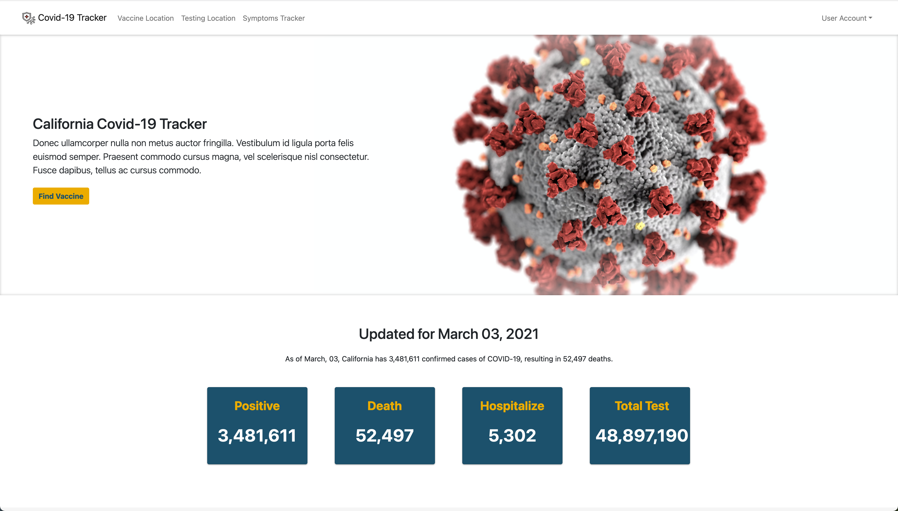

# California Covid-19 Tracker

<!-- TABLE OF CONTENTS -->

  
Table of Contents

  <ol>
    <li>
      <a href="#about-the-project">About The Project</a>
      <ul>
        <li><a href="#built-with">Built With</a></li>
      </ul>
    </li>
    <li>
      <a href="#getting-started">Getting Started</a>
      <ul>
        <li><a href="#prerequisites">Prerequisites</a></li>
        <li><a href="#installation">Installation</a></li>
      </ul>
    </li>
    <li><a href="#usage">Usage</a></li>
    <li><a href="#roadmap">Roadmap</a></li>
    <li><a href="#contributing">Contributing</a></li>
    <li><a href="#license">License</a></li>
    <li><a href="#contact">Contact</a></li>
    <li><a href="#acknowledgements">Acknowledgements</a></li>
  </ol>

<!-- ABOUT THE PROJECT -->
## About The Project

>>>>ABOUT PROJECT

### Built With
* [Python](https://docs.python.org/3/)
* [Flask](https://flask.palletsprojects.com/en/1.1.x/)
* [SQLAlchemy](https://docs.sqlalchemy.org/en/13/)
* [Jinja](https://jinja.palletsprojects.com/en/2.11.x/)
* [Bootstrap](https://getbootstrap.com)
* [JQuery](https://jquery.com)
* [HTML/CSS]
* [JavaScript]

